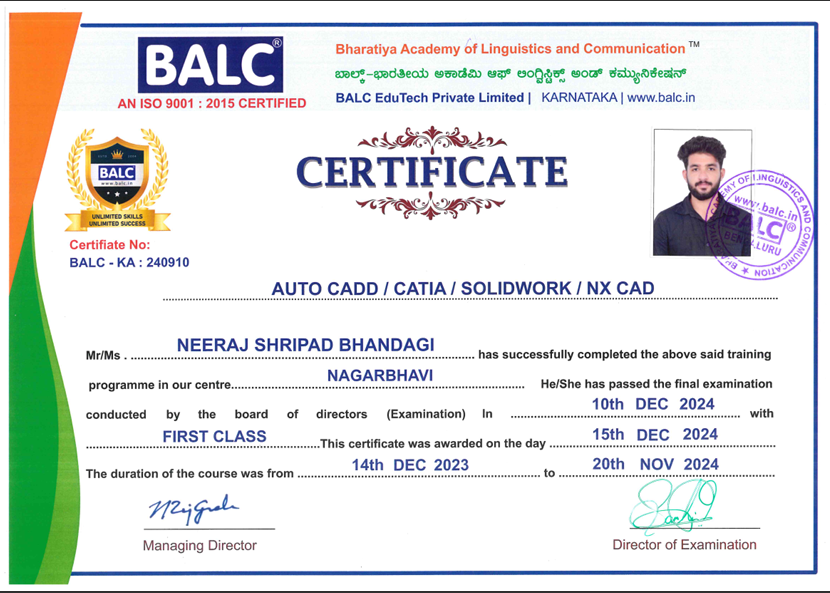

# 👋 Hello there! I'm Neeraj  

🚀 **About Me**  
As a **final-year Mechanical Engineering student**, I am passionate about exploring and solving engineering challenges through design, simulations, and innovative problem-solving. I thrive at the intersection of creativity and technology, with a strong foundation in **CAD modeling, engineering analysis, and CNC programming**.  

🌟 **My Goal:**  
To contribute to cutting-edge projects in **mechanical design and product development** by applying my technical expertise and continuously evolving my skills.  

---

## 🌱 **Currently Learning**  
- Advanced **CAD/CAM techniques**  
- Exploring **simulation tools** like MATLAB and Fusion 360  
- Enhancing my knowledge in **automation and robotics**  

### My Certificate:  

---

## 👀 **Interests**  
- **CAD Modeling**: Creating innovative and efficient designs using tools like CATIA, SolidWorks, and NX CAD.  
- **CNC Programming & Simulations**: Transforming concepts into reality with precision manufacturing.  
- **Product Development**: From ideation to prototyping and testing.  

---

## 💼 **Key Skills**  
- **CAD/CAM** (AutoCAD, SolidWorks, NX CAD, CATIA)  
- **CNC Programming**  
- **MATLAB**  
- **Teamwork & Project Management**  
- **Problem-solving & Innovation**  

---

## 🎓 **Education**  
**Bachelor of Engineering (B.E.) in Mechanical Engineering**  
Don Bosco Institute of Technology  
- Relevant Coursework: Thermodynamics, Fluid Mechanics, Machine Design, Manufacturing Processes, CAD/CAM  

---

## 🛠️ **Certifications**  
- **AutoCAD**: Mastery in 2D/3D technical drawings for mechanical components.  
- **SolidWorks**: Expertise in 3D modeling, assembly design, and stress analysis.  
- **NX CAD**: Proficiency in Siemens NX for advanced engineering solutions.  
- **CATIA**: Skilled in parametric design, complex surface modeling, and assembly creation.  

---

## 🌟 **Highlighted Project**  
### Multi-Functional 6WD Robot for Tilling and Pesticide Spraying  
- **Duration**: Sep 2024 – Dec 2024  
- **Team Size**: 4 members  
- **Tools Used**: Fusion 360, Solid Edge  
- **Technologies**: ESP32 microcontroller, BTS7960 & L298N motor drivers, Arduino-based programming  

**Objective**: Designed and developed a compact robot for automating soil tilling and pesticide spraying in small-scale agriculture and confined spaces like nurseries and poultry farms.  

**Results**:  
- Achieved stability across uneven terrains.  
- Delivered uniform tilling and pesticide coverage.  

---

## 💬 **Let’s Connect!**  
Feel free to reach out to me on **[LinkedIn](https://www.linkedin.com/in/neeraj-shripad-bhandagi/)** for collaboration, networking, or just a friendly chat about engineering, design, or robotics!  

---

😄 **Pronouns**: He/Him  
⚡ **Fun Fact**: I’m constantly amazed by how a simple idea can transform into a fully functioning product through design and engineering!  
